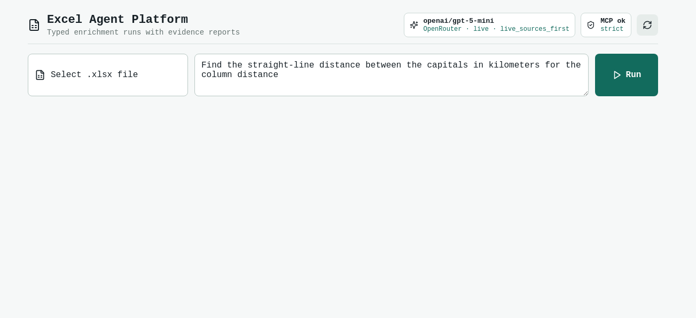
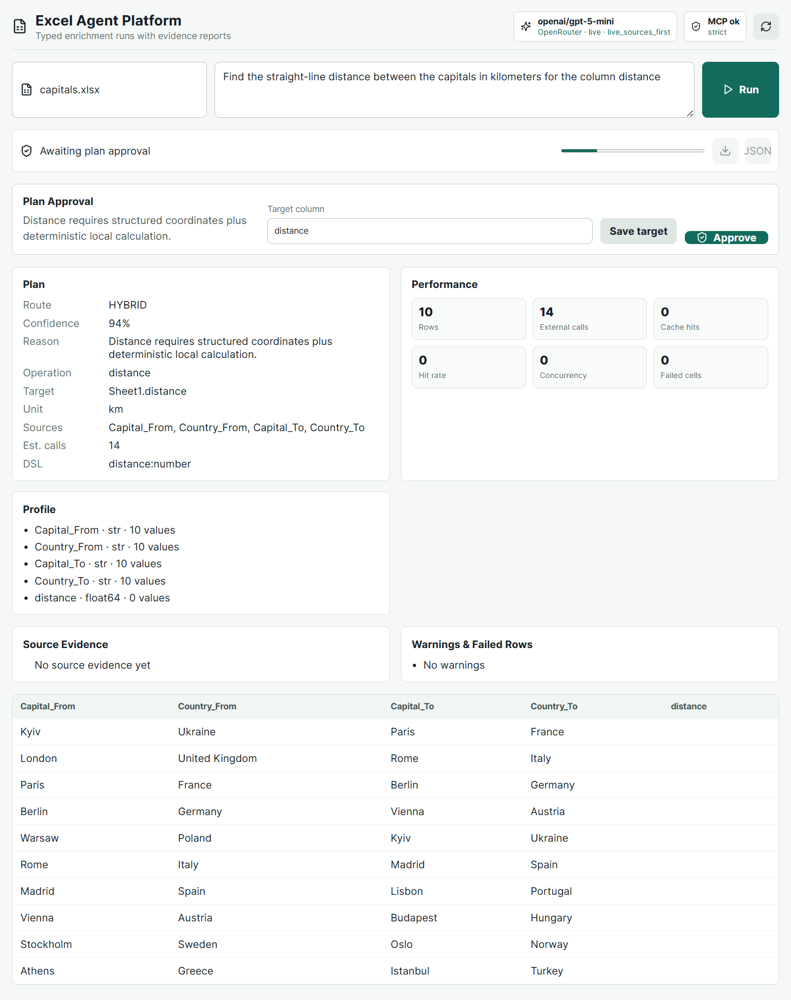
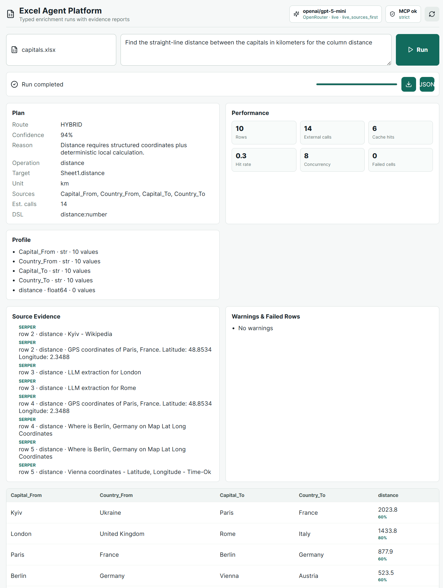
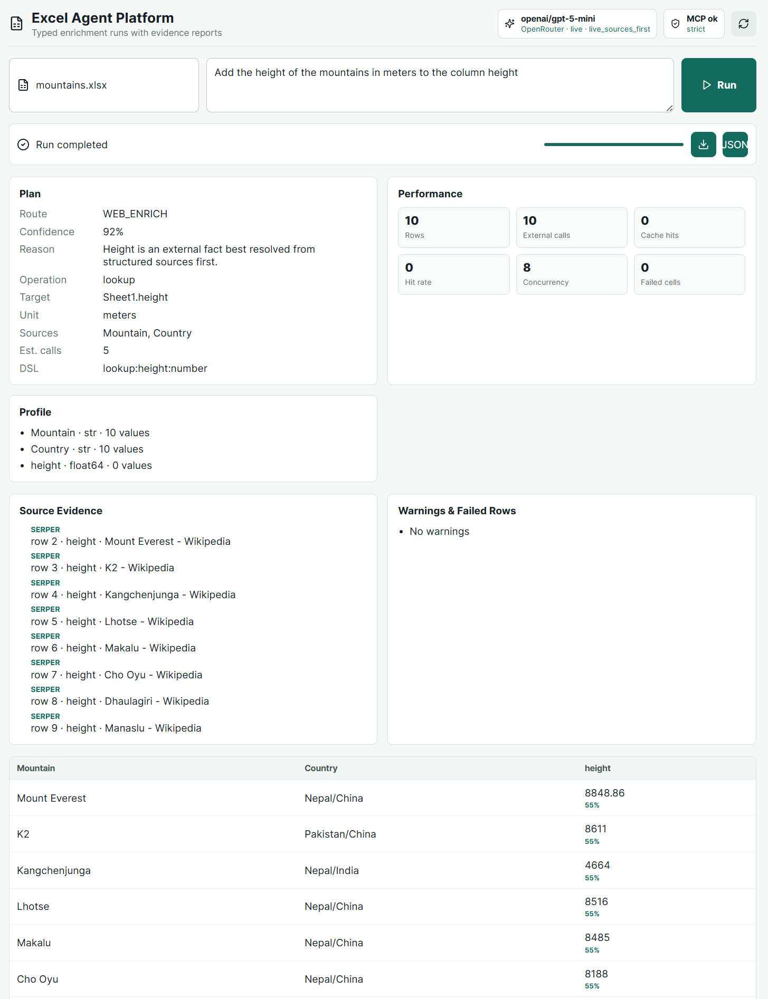
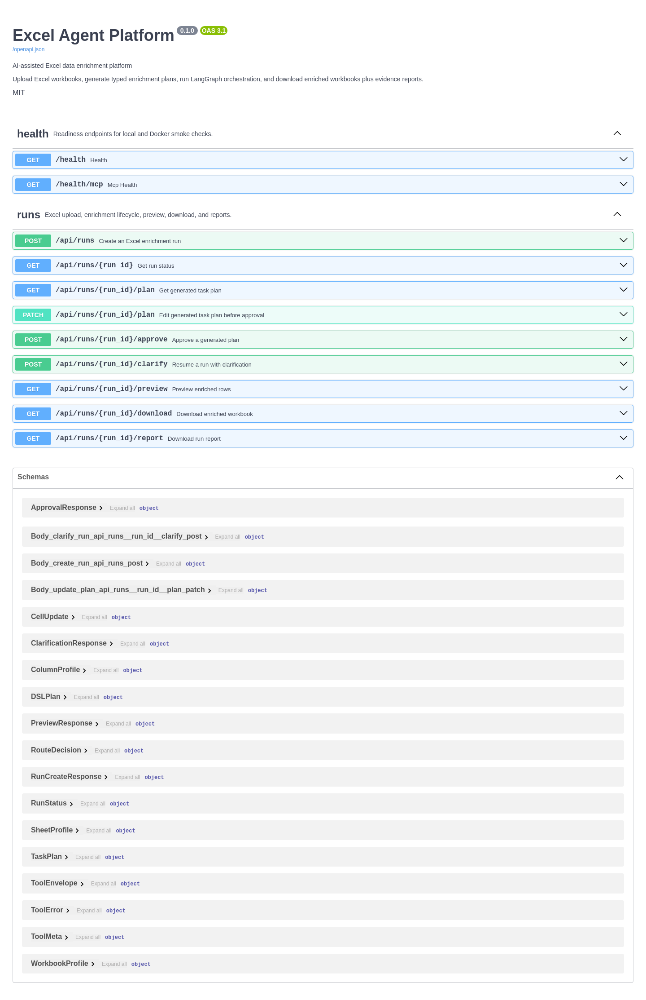
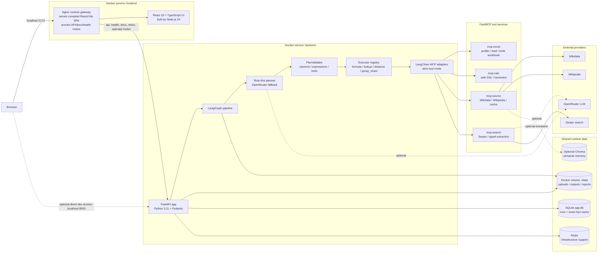

# Excel Agent Platform

AI system for enriching Excel data with deterministic calculations, structured public sources, web search fallback, and typed reports.

## What It Does

- **Universal LLM Planner Fallback**: Accepts an Excel workbook and a natural-language task, planning it via rule-based patterns or falling back to an OpenRouter LLM-based planner that analyzes the sheet profile and column types to generate typed `TaskPlan` and `DSLPlan` execution configurations.
- **LLM Search Extraction Fallback**: If regex patterns fail to match facts or coordinates in Serper snippets, queries an LLM to extract the precise value (e.g. coordinates, height in meters, or date) with associated confidence.
- **Flexible Formula DSL with `col(...)`**: Supports evaluating safe arithmetic formulas over columns with spaces, dashes, or Cyrillic characters using `col("Column Name")` syntax and math helpers (`add`, `sub`, `mul`, `div`).
- **Structured Source Integration**: Prioritizes Wikidata/Wikipedia structured records before executing Serper search.
- **LangGraph Pipeline**: Manages execution state, validation nodes, and user approval workflows.
- **LangGraph fan-out**: Large source-backed workbooks are automatically split into configurable row chunks to run concurrently.
- **SQLite Fact Cache**: Speeds up runs and reduces search API costs by storing and matching unique entity facts.
- **Human-in-the-Loop Approval**: Pauses for approval before starting costly hybrid/web searches, allowing you to edit the target column first.

## Quick Start

```bash
cd excel-agent-platform
cp .env.example .env
docker compose up --build
```

Docker builds the frontend with Node.js 24 LTS. For local frontend commands, use Node.js `>=24` and npm `>=11`.

- Frontend: http://localhost:5173
- Backend: http://localhost:8000
- Swagger/OpenAPI: http://localhost:8000/docs
- ReDoc: http://localhost:8000/redoc

## Docker Smoke Checks

Once Docker is fully booted, you can verify container health using these API checks:

```bash
# Verify API service is active
curl http://localhost:8000/health

# Verify all 4 MCP servers are healthy and strict tools are registered
curl http://localhost:8000/health/mcp
```

Expected `/health/mcp` output:
```json
{
  "status": "ok",
  "strict": true,
  "servers": {
    "excel": {"status": "ok", "configured": true, "tools": [...]},
    "calc": {"status": "ok", "configured": true, "tools": [...]},
    "source": {"status": "ok", "configured": true, "tools": [...]},
    "search": {"status": "ok", "configured": true, "tools": [...]}
  }
}
```

## Demo Screenshots

The screenshots below were captured after building the Docker stack in live mode. Source evidence comes from Wikidata, with Serper and LLM extraction available as fallbacks.

### Upload and Run Workspace

Initial screen with the Excel upload control, natural-language task prompt, model status, and strict MCP status.



### Human Approval Gate

Web-backed enrichment pauses before execution and shows the generated route, target column, operation preview, estimated calls, and workbook profile.



### Enriched Result With Evidence

Completed capitals and mountains enrichment showing filled values, confidence markers, performance/cache metrics, source evidence, and download controls for the workbook/report.

1. Completed capitals enrichment result


2. Completed mountains enrichment result


### API Documentation

FastAPI Swagger/OpenAPI documentation for health checks, run lifecycle, plan review, downloads, and report endpoints.



## Final Evaluation Pack

Run the full local evidence pack before submission:

```bash
make eval
```

It executes lint, unit, contract, integration, e2e, routing-eval, and 1000-row performance checks, then prints a final project summary. The key checks are:

- `ruff check`: backend lint and import hygiene.
- `tests/e2e/test_golden_accuracy.py`: mandatory capitals and mountains accuracy against golden references.
- `tests/e2e/test_golden_accuracy.py::test_final_project_mountains_dataset`: exact 4-row mountains dataset from the final project statement.
- `tests/e2e/test_universal_tasks.py`: formula, spaced-column formula, group share, generic lookup, and hybrid lookup + formula without code changes between scenarios.
- `tests/evals/test_planner_routing_eval.py`: route-selection matrix for TABLE_CALC, WEB_ENRICH, HYBRID, and CLARIFICATION_REQUIRED.
- `tests/performance/test_1000_rows.py`: 1000-row formula and group-share runs under 5 seconds.
- `tests/contracts/test_fact_contract.py`: typed `FactResult` guarantees for coordinates and numeric facts.

For Docker readiness after the stack is running:

```bash
docker compose up --build -d
make docker-health
```


## Repository Artifact Cleanup

To clean up all runtime spreadsheets, uploads, caches, databases and Python compiled files before sharing the code, run:

```bash
cd backend
python clean_artifacts.py
```


## Architecture

### Technology Stack

- **Frontend**: React 19 + TypeScript + Vite. Node.js 24 is used at build time only; the production container serves compiled static assets.
- **Frontend runtime / gateway**: Nginx 1.27 Alpine. It serves the React SPA and reverse-proxies `/api/*`, `/health*`, `/docs`, `/redoc`, and `/openapi.json` to the backend container.
- **Backend API**: FastAPI + Pydantic v2 on Python 3.11, exposed as the `backend` Docker Compose service on port `8000`.
- **Orchestration**: LangGraph coordinates workbook profiling, planning, execution, validation, output writing, and report generation.
- **Planner and contracts**: deterministic router first, OpenRouter LLM fallback when confidence/validation is insufficient, typed `TaskPlan`, `DSLPlan`, `FactResult`, and stable error envelopes.
- **Tool boundary**: FastMCP servers isolate Excel IO, deterministic calculation, structured source lookup, and search fallback.
- **Persistence**: SQLite stores run lifecycle and exact fact cache; Redis is available for infrastructure support; optional Chroma semantic memory can be enabled.
- **External sources**: offline demo seeds, Wikidata/Wikipedia structured lookups, Serper search fallback, and optional LLM extraction from snippets.

### Runtime Topology

The frontend and backend are **separate Docker services**:

- `frontend`: Nginx container with compiled React assets. It is the browser-facing entry point at `http://localhost:5173`.
- `backend`: FastAPI container at `http://localhost:8000`, also reachable through the frontend gateway for same-origin browser calls.
- `mcp-excel`, `mcp-calc`, `mcp-source`, `mcp-search`: independent FastMCP services used by the backend through HTTP MCP adapters.

So the frontend is separate from the backend at the container/service level. In the browser, however, API calls are same-origin because Nginx in the frontend container proxies `/api/*` and health/docs routes to `backend:8000` inside the Docker network.



The backend creates a workbook profile and typed `TaskPlan` first. Safe local formula plans can execute immediately; risky web-backed or hybrid plans wait for human approval before the LangGraph enrichment run starts. The planner is rule-first for deterministic demo cases and uses an OpenRouter LLM fallback when a task is novel, low-confidence, or needs a richer DSL plan.

The browser uses same-origin API calls in Docker through the frontend Nginx service. Nginx serves the SPA, proxies `/api/*`, `/health*`, `/docs`, `/redoc`, and `/openapi.json` to FastAPI, applies upload/rate/time limits, and returns the same JSON error envelope for gateway-level failures such as `413`, `429`, and upstream `5xx`. The UI exposes route confidence, route reasoning, operations preview, estimated external calls, performance/cache metrics, source evidence, failed rows, workbook download, and report download so the grading criteria are visible during a demo run.

## Project Structure

```text
excel-agent-platform/
├── backend/
│   ├── app/
│   │   ├── agents/        # Task routing, DSL-first planning, validation
│   │   ├── api/           # FastAPI runs and health endpoints
│   │   ├── graph/         # LangGraph state, nodes, and graph builder
│   │   ├── schemas/       # Pydantic contracts for DSL, runs, evidence, workbook profiles
│   │   ├── services/      # MCP gateway, SQLite run/cache store, runner, optional Chroma memory
│   │   └── tools/         # Local deterministic Excel, calc, source, and search implementations
│   ├── clean_artifacts.py # Automated cleanup helper
│   ├── Dockerfile
│   ├── poetry.lock
│   └── pyproject.toml
├── frontend/
│   ├── src/               # React UI for upload, plan approval, profile, preview, downloads
│   ├── Dockerfile         # Node.js 24 build stage + nginx gateway/runtime
│   ├── nginx.conf         # SPA serving plus /api and /health reverse proxy
│   ├── package-lock.json
│   └── package.json
├── mcp_servers/
│   ├── excel_server/      # FastMCP Excel IO tools with DATA_DIR path sandboxing
│   ├── calc_server/       # Safe formula DSL and distance tools
│   ├── source_server/     # Structured source lookup tools
│   └── search_server/     # Serper search and typed extraction tools
├── tests/
│   ├── api/
│   ├── e2e/
│   ├── fixtures/          # capitals.xlsx and mountains.xlsx
│   ├── integration/
│   └── unit/
├── data/                  # Runtime uploads, outputs, reports, cache, SQLite DB
├── docs/                  # Implementation notes and runbook
├── docker-compose.yml
├── .env.example
└── README.md
```

## Direct Python Usage

```python
from app.process import process_excel

result = process_excel(
    file_path="../capitals.xlsx",
    task_description="find the straight-line distance between the capitals in kilometers for the column distance",
)
print(result.output_path)
```

## Environment

The app reads secrets from environment variables. Do not commit `.env`.

- `OPENROUTER_API_KEY`: API key for LLM planner fallback, label resolution, and Serper extraction.
- `OPENROUTER_MODEL`: Model name (default `openai/gpt-5-mini`).
- `SERPER_API_KEY`: Serper API key for Google web search fallback.
- `LANGCHAIN_API_KEY`: Optional LangSmith tracing key.
- `OFFLINE_DEMO_SEED_FIRST`: Set to `true` for offline development/testing using mocked capitals & mountains datasets. Set to `false` for online lookup.
- `MCP_STRICT_TOOLS`: Set to `false` for local dev/testing without booting up local MCP server daemons. Set to `true` in production or Docker Compose to enforce strict adapter isolation.
- `ENRICHMENT_CONCURRENCY`: optional, default `8`
- `GRAPH_FANOUT_THRESHOLD`: optional, default `1000`
- `GRAPH_CHUNK_SIZE`: optional, default `1000`
- `GRAPH_FANOUT_CONCURRENCY`: optional, default `4`
- `MCP_EXCEL_URL`: optional in Docker, default `http://mcp-excel:8101/mcp`
- `MCP_CALC_URL`: optional in Docker, default `http://mcp-calc:8102/mcp`
- `MCP_SOURCE_URL`: optional in Docker, default `http://mcp-source:8103/mcp`
- `MCP_SEARCH_URL`: optional in Docker, default `http://mcp-search:8104/mcp`

## Test Data

The repository includes test datasets in `tests/fixtures/`:

- `capitals.xlsx`
- `mountains.xlsx`

These datasets are compatible with both the local offline seed paths and the live online search/extraction routing.
